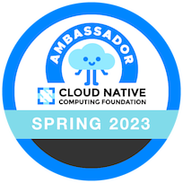
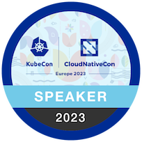

  

  <h1>Hi, I'm Kris - The Coding Unicorn!:smiley_cat:</h1>

  

    
    
  

## 🧙‍♀️ About Me

:tiger: A techie from Norway who loves preaching about all things cloud native, Kubernetes, green tech and cats. An active supporter of sustainability in tech and outside of it, and animal welfare.

⛅️ Microsoft Azure MVP and CNCF Ambassador

💚 Founder of [Green Software Foundation Oslo](https://www.meetup.com/gsf-oslo) meetup group

🌱 [CNCF Green Reviews Working Group](https://github.com/cncf/tag-env-sustainability/tree/main/working-groups/green-reviews) chair

🎙️ Co-Host at [Kubernetes Unpacked](https://packetpushers.net/series/kubernetes-unpacked) podcast

🚀 [Kubernetes and Cloud Native Community Days (KCD) Oslo 2024](https://community.cncf.io/events/details/cncf-kcd-norway-presents-kcd-oslo-2024) organizer

:whale2: I love learning new things and sharing my journey and experiences with others. My goal is to inspire others developers to code with sustainability, security and cloud native principles in mind. I also hope that with my actions and contributions I can inspire and motivate more ladies to join the world of tech!

:octopus: I strongly believe that contributing to making this world a better place by volunteering is something all of us should consider doing, therefore being a volunteer is a big part of my life. Both when it comes to contributing back to tech community and non-profit organizations making a crucial positive impact in other areas of our life on this planet.

## 👩‍💻 Tech

My main area of interest is secure and sustainable cloud native application development. Some of the technologies I'm working with:

  &nbsp;
  &nbsp;
  &nbsp;
  &nbsp;
  &nbsp;
  &nbsp;
  &nbsp;
  &nbsp;
  &nbsp;
  
  
  

## 🙌🏼 Community Volunteering

* Board member at Norwegian .NET User Group Oslo: [NNUG Oslo](https://www.meetup.com/nnugoslo) and [Cloud Native Norway](https://www.linkedin.com/company/cloudnativenorway)
* Co-organizer at [Cloud Native and Kubernetes Oslo](https://www.meetup.com/cloud-native-and-kubernetes-oslo) and [DEVREAL Oslo](https://www.meetup.com/devreal)
* Maintainer and contributor of [CNCF TAG Environmental Sustainability](https://tag-env-sustainability.cncf.io)
* Community Advocate at [StreamingClouds](http://community.streamingclouds.io)
* OWASP volunteer:  [OWASP](https://owasp.org)
* Mentor at GirlCode: [GirlCode](https://www.girl-code.co.uk/findamentor/kristina-devochko) and WomenTech: [womentech](https://www.womentech.net/women-tech-mentors?combine=Devochko&webform_submission_value_1%5B%5D=Norway)
* Volunteer at an animal shelter

## 💫 Open Source Contributions

I'm currently contributing to following projects:

* **Anatole Hugo Theme:** [anatole](https://github.com/lxndrblz/anatole)

* **Sprint Name Generator:** [sprint-name-generator](https://github.com/flostadler/sprint-name-generator)

* **TAG Environmental Sustainability:** [tag-env-sustainability](https://github.com/cncf/tag-env-sustainability)

## 🚀 Badges

  
  
  
  
   
  
    

## 📜 Recent Blog Posts

<!-- BLOG-POST-LIST:START -->
- [Resilience testing of Azure services with Azure Chaos Studio](https://kristhecodingunicorn.com/post/azure_chaos_studio/)
- [Kubernetes port forwarding: cleaning up orphaned ports](https://kristhecodingunicorn.com/post/k8s_port_forwarding_cleanup/)
- [How to get all Azure Policy assignments of a specific category?](https://kristhecodingunicorn.com/post/azpolicy_category_assignments/)
- [Resolving Application Insights performance counters collection issue for .NET applications](https://kristhecodingunicorn.com/post/appinsights_perfcounters/)
- [Scanning Azure VMs, Azure Arc-enabled servers and ACR images for vulnerabilities with Microsoft Defender and Qualys](https://kristhecodingunicorn.com/post/azure_qualys/)
- [Takeaways from attending KubeCon+CloudNativeCon Europe 2023, wearing many hats](https://kristhecodingunicorn.com/post/kubecon_cloudnativecon_eu_2023/)
- [Creating custom Azure Policy for Kubernetes to disallow non-compliant image registries](https://kristhecodingunicorn.com/post/k8s_deprecated_registry_azpolicy/)
- [Keeping AKS clusters continuously secure with Azure Policy](https://kristhecodingunicorn.com/post/aks_azure_policy/)
- [[🎄.NET Advent Calendar🎄] Strengthening security posture of containerized .NET applications with Chiseled Ubuntu Containers](https://kristhecodingunicorn.com/post/dotnet_ubuntu_chiseled/)
- [[🎄Azure Advent Calendar🎄] Exploring upgrade strategies in Azure Kubernetes Service](https://kristhecodingunicorn.com/post/k8s_upgrade_strategy/)
<!-- BLOG-POST-LIST:END -->

## 📜 Recent Tech Tips

<!-- TECH-TIPS-LIST:START -->
- [How to trigger subsequent GitHub workflow in a different repository](https://kristhecodingunicorn.com/techtips/gh_crossrepo_wf_trigger/)
- [AKS control plane tiers - what, when and how?](https://kristhecodingunicorn.com/techtips/aks_controlplane_tiers/)
- [How to modify Azure Arc &lpar;or any&rpar; Service Principal scope after creation](https://kristhecodingunicorn.com/techtips/azure_sp_scope/)
- [How to fix ServiceAccount error in Azure DevOps Environments for Kubernetes clusters v.1.24 and newer](https://kristhecodingunicorn.com/techtips/ado_sa_error/)
- [Kris&#39;s Quick Cup of &lpar;A&rpar;K8S #5 - Housekeeping for Kubernetes Contexts](https://kristhecodingunicorn.com/techtips/kris_daily_k8s_5/)
- [Validating quality of Helm Charts with helm lint](https://kristhecodingunicorn.com/techtips/helm_lint/)
- [Kris&#39;s Quick Cup of &lpar;A&rpar;K8S #4 - HTTP Application Routing add-on in AKS](https://kristhecodingunicorn.com/techtips/kris_daily_k8s_4/)
- [Kris&#39;s Quick Cup of &lpar;A&rpar;K8S #3 - &lpar;Cluster&rpar;Role management](https://kristhecodingunicorn.com/techtips/kris_daily_k8s_3/)
- [How to override ASP.NET Core application runtime version](https://kristhecodingunicorn.com/techtips/dotnet_runtime_framework/)
- [Detect and avoid this certificate validation trap in .NET!](https://kristhecodingunicorn.com/techtips/dotnet_https_validation/)
<!-- TECH-TIPS-LIST:END -->

## 🦄 Recent Events (Past and Upcoming)

<!-- EVENTS-LIST:START -->
- [📺 25th October, 2023: MVP-Dagen Oslo - Exploring GitOps on Azure](https://mvp-dagen-2023.sessionize.com/session/513076)
- [📺 11th October, 2023: Women on Stage Global Virtual Conference 2023 - Exploring chaos engineering…the FUN way!](https://www.womenonstage.net/global-virtual-conference-2023)
- [📺 9th October, 2023: GSF Oslo October meetup - Getting started with green software and cloud native sustainability](https://www.meetup.com/gsf-oslo/events/295698438)
- [📺 20th September, 2023: Microsoft Build Norway - Exploring DevSecOps controls for Kubernetes throughout the value chain](https://msevents.microsoft.com/event?id=3464278356)
- [📺 16th September, 2023: Microsoft Azure Pakistan Community - AKS Survival Pack: what to consider before going all-in with AKS](https://www.meetup.com/Microsoft-Azure-Pakistan-Community/events/294272415)
- [📝 25th August, 2023: kode24 article - “Lanserer klimanettverk for utviklere”](https://www.kode24.no/artikkel/lanserer-klimanettverk-for-utviklere-mange-er-negative/80111720)
- [📺 26th July, 2023: Cloud Lunch &amp; Learn - Managed Kubernetes Service: Day Zero Survival Pack](https://www.meetup.com/azuredublin/events/294393389)
- [📺 12th July, 2023: Cloud Lunch &amp; Learn - Deploying microservices to AKS with ADO Environments and multi-staged Pipelines](https://www.meetup.com/azuredublin/events/294393334)
- [📺 27th June, 2023: InfoQ Live Panel Discussion - Beyond Default Settings: Evaluating the Security of Kubernetes and Cloud Native Environments](https://www.infoq.com/presentations/kubernetes-security-cloud-native)
- [📺 21st June, 2023: Cloud Native and Kubernetes Oslo - Sustainable Kubernetes and how YOU can make an impact](https://www.meetup.com/cloud-native-and-kubernetes-oslo/events/294099940)
<!-- EVENTS-LIST:END -->

## 🦆Tweet Tweet

---
Creds for the Cat GIF: Zakmotion @dribbble.com

Creds for tech icons: GitHub devicons, icons8.com and Darius Dan @flaticon (Kubernetes icon)
