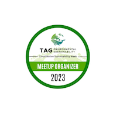
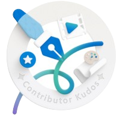

  

  <h1>Hi, I'm Kris - The Coding Unicorn!😺</h1>

  

    
    
  

## 🧙‍♀️ About Me

:tiger: Platform Engineer, preaching about all things cloud native, Kubernetes, green tech and cats. Animal welfare advocate.

⛅️ Microsoft Azure MVP and CNCF Ambassador

💚 Founder of [Green Software Foundation Oslo](https://www.meetup.com/gsf-oslo) meetup group

🌱 [CNCF TAG Environmental Sustainability](https://tag-env-sustainability.cncf.io) tech lead

🎙️ Co-Host at [Kubernetes Unpacked](https://packetpushers.net/series/kubernetes-unpacked) podcast

🚢 [Kubernetes and Cloud Native Community Days (KCD) Oslo 2024](https://community.cncf.io/events/details/cncf-kcd-norway-presents-kcd-oslo-2024) organizer

## 👩‍💻 Tech Stack

  &nbsp;
  &nbsp;
  &nbsp;
  &nbsp;
  &nbsp;
  &nbsp;
  &nbsp;
  &nbsp;
  &nbsp;
  &nbsp;
  
  
  

## 🙌🏼 Community Volunteering

* Board member at Norwegian .NET User Group Oslo: [NNUG Oslo](https://www.meetup.com/nnugoslo) and [Cloud Native Norway](https://www.linkedin.com/company/cloudnativenorway)
* Co-organizer at [Cloud Native and Kubernetes Oslo](https://www.meetup.com/cloud-native-and-kubernetes-oslo) and [StreamingClouds(retired)](https://www.youtube.com/@StreamingClouds)
* OWASP volunteer:  [OWASP](https://owasp.org)
* Mentor at GirlCode: [GirlCode](https://www.girl-code.co.uk/findamentor/kristina-devochko) and WomenTech: [womentech](https://www.womentech.net/women-tech-mentors?combine=Devochko&webform_submission_value_1%5B%5D=Norway)
* Volunteer at local animal shelters

## 💫 Open Source Contributions

* **Anatole Hugo Theme:** [anatole](https://github.com/lxndrblz/anatole)

* **Sprint Name Generator:** [sprint-name-generator](https://github.com/flostadler/sprint-name-generator)

* **TAG Environmental Sustainability:** [tag-env-sustainability](https://github.com/cncf/tag-env-sustainability)

## 🚀 Badges

  
  
  
  
  
  
   
  
    

## 📜 Recent Blog Posts

<!-- BLOG-POST-LIST:START -->
- [Christmas the Whole Year Round...and Year++ with Kubernetes LTS](https://kristhecodingunicorn.com/post/kubernetes-lts/)
- [Passing Kubernetes and Cloud Native Associate &lpar;KCNA&rpar; certification exam](https://kristhecodingunicorn.com/post/passing-kcna-certification-exam/)
- [A bird&#39;s-eye view of upcoming KubeCon+CloudNativeCon North America 2023](https://kristhecodingunicorn.com/post/kubecon-cloudnativecon-na-2023-expectations/)
- [Resilience testing of Azure services with Azure Chaos Studio](https://kristhecodingunicorn.com/post/azure-services-resilience-testing-with-azure-chaos-studio/)
- [Kubernetes port forwarding: cleaning up orphaned ports](https://kristhecodingunicorn.com/post/kubernetes-port-forwarding-cleanup-of-orphaned-ports/)
- [How to get all Azure Policy assignments of a specific category?](https://kristhecodingunicorn.com/post/get-azure-policy-assignment-of-category/)
- [Resolving Application Insights performance counters collection issue for .NET applications](https://kristhecodingunicorn.com/post/application-insights-perfcounters-collection-issue-dotnet/)
- [Scanning Azure VMs, Azure Arc-enabled servers and ACR images for vulnerabilities with Microsoft Defender and Qualys](https://kristhecodingunicorn.com/post/scan-azurevm-azurearc-acr-with-defender-and-qualys/)
- [Takeaways from attending KubeCon+CloudNativeCon Europe 2023, wearing many hats](https://kristhecodingunicorn.com/post/kubecon-cloudnativecon-eu-2023-takeaways/)
- [Creating custom Azure Policy for Kubernetes to disallow non-compliant image registries](https://kristhecodingunicorn.com/post/custom-azure-policy-for-k8s-image-registries-compliance/)
<!-- BLOG-POST-LIST:END -->

## 🦄 Recent Events (Past and Upcoming)

<!-- EVENTS-LIST:START -->
- [📝 2nd January, 2024: Microsoft Azure Community Blog - Contributor Stories: Kristina Devochko](https://techcommunity.microsoft.com/t5/azure-developer-community-blog/contributor-stories-kristina-devochko/ba-p/4017860?wt.mc_id=contributorstories_techcommunity_blog_cxa)
- [📺 21st December, 2023: Women in Cloud Native - Journey in Tech &amp; all about Sustainability in Tech w/ Kristina](https://www.youtube.com/watch?v=EoL2X4QB33M)
- [📺 30th November, 2023: Come Cloud With Us Panel - Microsoft Ignite 2023 After Party](https://www.meetup.com/comecloudwithus/events/296203008)
- [📺 29th November, 2023: Women on Stage Global Virtual Conference 2023 - Exploring chaos engineering…the FUN way!](https://www.womenonstage.net/global-virtual-conference-2023)
- [📺 25th October, 2023: MVP-Dagen Oslo - Exploring GitOps on Azure](https://mvp-dagen-2023.sessionize.com/session/513076)
- [📺 9th October, 2023: GSF Oslo October meetup - Getting started with green software and cloud native sustainability](https://www.meetup.com/gsf-oslo/events/295698438)
- [📺 20th September, 2023: Microsoft Build Norway - Exploring DevSecOps controls for Kubernetes throughout the value chain](https://msevents.microsoft.com/event?id=3464278356)
- [📺 16th September, 2023: Microsoft Azure Pakistan Community - AKS Survival Pack: what to consider before going all-in with AKS](https://www.meetup.com/Microsoft-Azure-Pakistan-Community/events/294272415)
- [📝 7th September, 2023: Microsoft Learn Community Content - “Manage cost and optimize resources in AKS with Kubecost”](https://learn.microsoft.com/en-us/community/content/how-to-utilize-kubecost-for-cost-management-of-aks)
- [📝 25th August, 2023: kode24 article - “Lanserer klimanettverk for utviklere”](https://www.kode24.no/artikkel/lanserer-klimanettverk-for-utviklere-mange-er-negative/80111720)
<!-- EVENTS-LIST:END -->

---
Creds for the Cat GIF: Zakmotion @dribbble.com

Creds for tech icons: GitHub devicons, icons8.com and Darius Dan @flaticon (Kubernetes icon)
