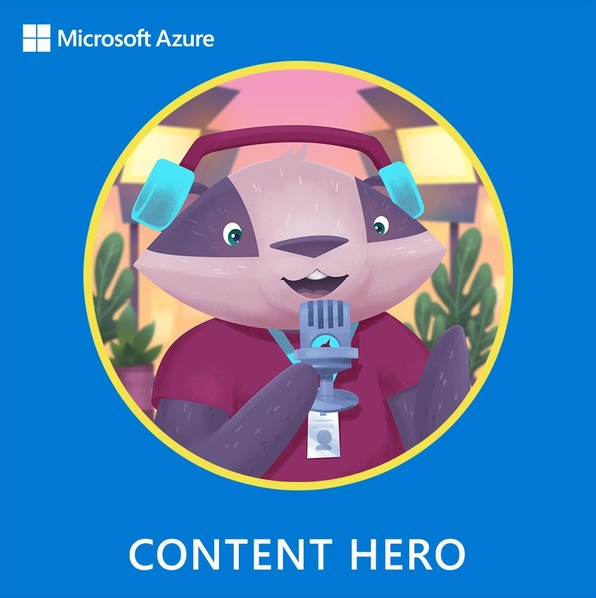
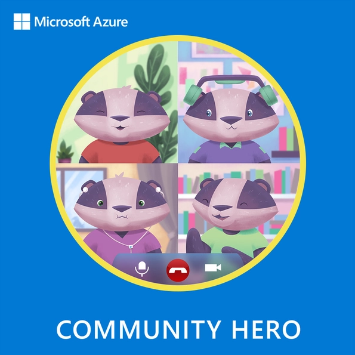

  

  <h1>Hi, I'm Kris - The Coding Unicorn!:smiley_cat:</h1>

  

    
    
    
    
    
  

## 🧙‍♀️About Me

:tiger: I'm a techie and a Potterhead. I live in Norway, love coding, cats, coffee and good books. With Animal Welfare at heart.

:whale2: I'm following Learning as a lifestyle mindset and love sharing my knowledge with the community.

:octopus: My biggest passion is tech and my goal is to help other developers to code with sustainability, security and cloud native mindset. I'm also determined to help more ladies to start their journey in tech by mentoring. 

## 👩‍💻Tech

My main area of interest is secure and sustainable cloud native application development with specialization in Microsoft technologies like Azure and .NET. Below you may see some of the technologies I'm using more or less on a daily basis:

  &nbsp;
  &nbsp;
  &nbsp;
  &nbsp;
  &nbsp;  
  &nbsp;
  &nbsp;
  &nbsp;  
  

## 🙌🏼Community Volunteering

* Board member at Norwegian .NET User Group Oslo: [NNUG Oslo](https://www.meetup.com/nnugoslo)
* Co-organizer at Cloud Native and Kubernetes Oslo:  [Cloud Native and Kubernetes Oslo](https://www.meetup.com/cloud-native-and-kubernetes-oslo)
* OWASP volunteer:  [OWASP](https://owasp.org)
* Mentor at GirlCode: [GirlCode](https://www.girl-code.co.uk/findamentor/kristina-devochko) and WomenTech: [womentech](https://www.womentech.net/women-tech-mentors?combine=Devochko&webform_submission_value_1%5B%5D=Norway)
* Mentor at TENK Tech Camp Oslo: [TENK Tech Camp](https://tenknorge.com/tenk-tech-camp)
* Volunteer at Dyrenes Hus animal shelter

## 🐾Open Source Contributions

I'm currently contributing to following projects:

**Anatole Hugo Theme:** [anatole](https://github.com/lxndrblz/anatole)

**Sprint Name Generator:** [sprint-name-generator](https://github.com/flostadler/sprint-name-generator)

## 🦡 Badges

  
  

## 📜Recent Blog Posts

<!-- BLOG-POST-LIST:START -->
- [Setting up OAuth 2.0 authentication for applications in AKS with NGINX and OAuth2 Proxy](https://kristhecodingunicorn.com/post/k8s_nginx_oauth/)
- [Accelerated Networking for AKS nodes](https://kristhecodingunicorn.com/post/k8s_an/)
- [Continuous Delivery to AKS with Azure DevOps Environments - Part 2](https://kristhecodingunicorn.com/post/k8s_ado_envs-2/)
- [Continuous Delivery to AKS with Azure DevOps Environments - Part 1](https://kristhecodingunicorn.com/post/k8s_ado_envs-1/)
- [Improving .NET code quality with NDepend in Visual Studio and Azure DevOps](https://kristhecodingunicorn.com/post/ndepend/)
- [Cleaning up secrets in Azure DevOps and GitHub repositories with BFG Repo-Cleaner](https://kristhecodingunicorn.com/post/secrets_cleanup/)
- [How to upgrade NGINX Ingress Controller with zero downtime in production](https://kristhecodingunicorn.com/post/k8s_ic_upgrade/)
- [How to include new Kubernetes resource into existing Helm release](https://kristhecodingunicorn.com/post/k8s_object_helm/)
- [Using Kubernetes Service for proxying to external services](https://kristhecodingunicorn.com/post/k8s_proxy_svc/)
- [How to perform static code analysis of .NET Code with Security Code Scan](https://kristhecodingunicorn.com/post/dotnet_sast_scs/)
<!-- BLOG-POST-LIST:END -->

## 📜Recent Tech Tips

<!-- TECH-TIPS-LIST:START -->
- [How to override ASP.NET Core application runtime version](https://kristhecodingunicorn.com/techtips/dotnet_runtime_framework/)
- [Detect and avoid this certificate validation trap in .NET!](https://kristhecodingunicorn.com/techtips/dotnet_https_validation/)
- [Log in to Azure AD without active subscription from Azure CLI](https://kristhecodingunicorn.com/techtips/azure_ad_login_subscription/)
- [Re-using Azure DevOps Environment efficiently across multiple pipelines](https://kristhecodingunicorn.com/techtips/ado_env_as_var/)
- [Creating reusable build tasks in Azure DevOps pipelines with templates](https://kristhecodingunicorn.com/techtips/ado_pipeline_template/)
<!-- TECH-TIPS-LIST:END -->

## 🦆Tweet Tweet

---
Creds for the Cat GIF: Zakmotion @dribbble.com

Creds for tech icons: GitHub devicons and Google search
