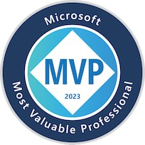

  

  <h1>Hi, I'm Kris - The Coding Unicorn!:smiley_cat:</h1>

  

    
    
    
    
    
    
  

## 🧙‍♀️ About Me

:tiger: I'm a techie and a Potterhead. I live in Norway, love coding, cats, coffee and good books. With Animal Welfare at heart.

⛅️ Microsoft MVP (Most Valuable Professional) in Microsoft Azure category.

:whale2: I'm following Learning as a lifestyle mindset and love sharing my knowledge with the community.

:octopus: My biggest passion is tech and my goal is to help other developers to code with sustainability, security and cloud native mindset. I'm also determined to help more ladies to start their journey in tech by mentoring. 

## 👩‍💻 Tech

My main area of interest is secure and sustainable cloud native application development with specialization in Microsoft technologies like Azure and .NET. Below you may see some of the technologies I'm using more or less on a daily basis:

  &nbsp;
  &nbsp;
  &nbsp;
  &nbsp;
  &nbsp;
  &nbsp;
  &nbsp;
  &nbsp;
  

## 🙌🏼 Community Volunteering

* Board member at Norwegian .NET User Group Oslo: [NNUG Oslo](https://www.meetup.com/nnugoslo)
* Co-organizer at Cloud Native and Kubernetes Oslo:  [Cloud Native and Kubernetes Oslo](https://www.meetup.com/cloud-native-and-kubernetes-oslo)
* OWASP volunteer:  [OWASP](https://owasp.org)
* Mentor at GirlCode: [GirlCode](https://www.girl-code.co.uk/findamentor/kristina-devochko) and WomenTech: [womentech](https://www.womentech.net/women-tech-mentors?combine=Devochko&webform_submission_value_1%5B%5D=Norway)
* Mentor at TENK Tech Camp Oslo: [TENK Tech Camp](https://tenknorge.com/tenk-tech-camp)
* Volunteer at Dyrenes Hus animal shelter

## 💫 Open Source Contributions

I'm currently contributing to following projects:

- **Anatole Hugo Theme:** [anatole](https://github.com/lxndrblz/anatole)

- **Sprint Name Generator:** [sprint-name-generator](https://github.com/flostadler/sprint-name-generator)

## 🚀 Badges

  
  
    

## 📜 Recent Blog Posts

<!-- BLOG-POST-LIST:START -->
- [[🎄.NET Advent Calendar🎄] Strengthening security posture of containerized .NET applications with Chiseled Ubuntu Containers](https://kristhecodingunicorn.com/post/dotnet_ubuntu_chiseled/)
- [[🎄Azure Advent Calendar🎄] Exploring upgrade strategies in Azure Kubernetes Service](https://kristhecodingunicorn.com/post/k8s_upgrade_strategy/)
- [Applying Dockerfile best practices with Hadolint](https://kristhecodingunicorn.com/post/k8s_hadolint/)
- [Azure DevOps Auditing - Part 1 - Overview and Streaming to Azure Monitor Logs](https://kristhecodingunicorn.com/post/ado-auditing-1/)
- [Monitoring Kubernetes API deprecations with Pluto](https://kristhecodingunicorn.com/post/k8s_pluto/)
- [Setting up OAuth 2.0 authentication for applications in AKS with NGINX and OAuth2 Proxy](https://kristhecodingunicorn.com/post/k8s_nginx_oauth/)
- [Accelerated Networking for AKS nodes](https://kristhecodingunicorn.com/post/k8s_an/)
- [Continuous Delivery to AKS with Azure DevOps Environments - Part 2](https://kristhecodingunicorn.com/post/k8s_ado_envs-2/)
- [Continuous Delivery to AKS with Azure DevOps Environments - Part 1](https://kristhecodingunicorn.com/post/k8s_ado_envs-1/)
- [Improving .NET code quality with NDepend in Visual Studio and Azure DevOps](https://kristhecodingunicorn.com/post/ndepend/)
<!-- BLOG-POST-LIST:END -->

## 📜 Recent Tech Tips

<!-- TECH-TIPS-LIST:START -->
- [How to modify Azure Arc &lpar;or any&rpar; Service Principal scope after creation](https://kristhecodingunicorn.com/techtips/azure_sp_scope/)
- [How to fix ServiceAccount error in Azure DevOps Environments for Kubernetes clusters v.1.24 and newer](https://kristhecodingunicorn.com/techtips/ado_sa_error/)
- [Kris&#39;s Quick Cup of &lpar;A&rpar;K8S #5 - Housekeeping for Kubernetes Contexts](https://kristhecodingunicorn.com/techtips/kris_daily_k8s_5/)
- [Validating quality of Helm Charts with helm lint](https://kristhecodingunicorn.com/techtips/helm_lint/)
- [Kris&#39;s Quick Cup of &lpar;A&rpar;K8S #4 - HTTP Application Routing add-on in AKS](https://kristhecodingunicorn.com/techtips/kris_daily_k8s_4/)
<!-- TECH-TIPS-LIST:END -->

## 🦄 Recent Events (Past and Upcoming)

<!-- EVENTS-LIST:START -->
- [📺 3rd May, 2023: Stockholm Tech Show - Managed Kubernetes Service: Day Zero Survival Pack](https://stockholmtechshow.se/konferens-2023/)
- [📺 16th March, 2023: KCD Ukraine - Managed Kubernetes Service: Day Zero Survival Pack](https://community.cncf.io/events/details/cncf-kcd-ukraine-presents-kcd-ukraine-2023-fundraiser/)
- [📺 23.-24. February, 2023: KCD Amsterdam - Managed Kubernetes Service: Day Zero Survival Pack](https://community.cncf.io/events/details/cncf-kcd-netherlands-presents-kubernetes-community-days-amsterdam-2023/)
- [📺 17th February, 2023: Come Cloud With Us - Kubernetes Panel Discussion](https://www.meetup.com/comecloudwithus/events/290494259/)
- [📺 8th February, 2023: Swetugg 2023 - Standardizing microservice-to-AKS workflow with dotnet custom templates and Azure DevOps](https://swetugg.se/sthlm-2023/speakers/kristina-devochko#standardizing-microservice-to-aks-workflow-with-dotnet-custom-templates-and-azure-devops)
<!-- EVENTS-LIST:END -->

## 🦆Tweet Tweet

---
Creds for the Cat GIF: Zakmotion @dribbble.com

Creds for tech icons: GitHub devicons, icons8.com and Darius Dan @flaticon (Kubernetes icon)
